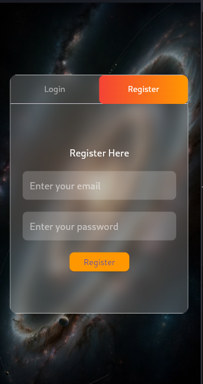
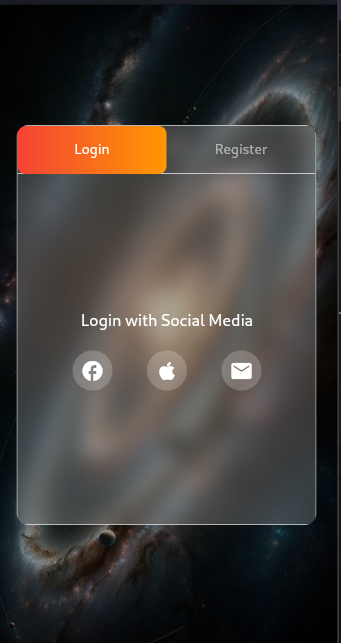

# Flutter Glassmorphic Login and Register Page

This Flutter project demonstrates a beautifully designed **glassmorphic login and register interface** using features like `BackdropFilter`, `TabController`, and `TabBarView`. It includes separate tabs for login and registration, each with interactive UI elements.

---

## Features
- **Glassmorphic design**: Achieved using a `BackdropFilter` and opacity layers for a frosted glass effect.
- **Login and Register Tabs**: Seamlessly switch between login and registration forms with a `TabBar`.
- **Responsive social media login**: Support for icons like Facebook, Apple, and Email.
- **Stylish text fields**: Custom-styled text fields with rounded corners and semi-transparent backgrounds.
- **Dynamic background**: A vibrant background image with a blur effect.

---

## Screenshots

### Login Page

### Register Page

---

